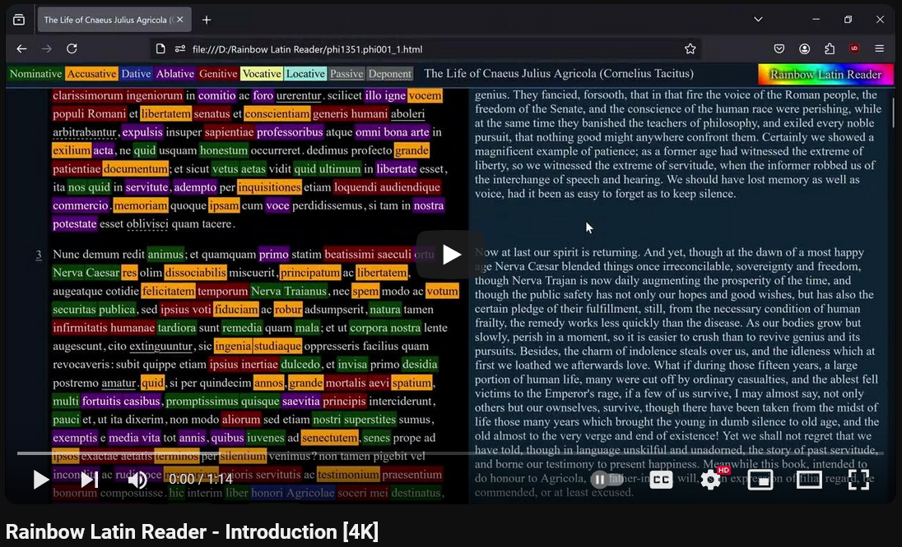

Rainbow Latin Generator
=======================

- [Rainbow Latin Generator](#rainbow-latin-generator)
- [Introduction](#introduction)
- [Credits](#credits)
- [Usage](#usage)
- [Architecture](#architecture)
- [Unit tests](#unit-tests)
- [Development setup](#development-setup)

# Introduction

This software generates Latin-English dual-language documents. See main webpage:
- https://bolner.github.io/rainbow-latin-reader/index.html

Watch the introduction video on YouTube:

[](https://www.youtube.com/watch?v=9ufyqLxwcEE)

# Credits

Rainbow Latin Reader was created by [Tamas Bolner](https://github.com/bolner)
and published under the [Apache License](http://www.apache.org/licenses/LICENSE-2.0)
(Copyright 2024). It is based on the following 3 projects:

- Perseus Canonical Latin literature:
  - https://github.com/PerseusDL/canonical-latinLit
- Whitaker's WORDS
  - https://github.com/mk270/whitakers-words
- Lemmatized Latin texts by Thibault Clérice et al.:
  - https://github.com/lascivaroma/latin-lemmatized-texts/

# Usage

- Inside the `RainbowLatinReader` directory: Copy the `config.ini.template` as `config.ini` and fill in the missing paths.
- Create the output directory that is specified as `output.dir` in the config file. (You can create an `output` folder inside the project directory, as that is already added to the `.gitignore` file.)
- Before you compile Whitaker's Words, change these settings:
  - File: `src/support_utils/support_utils-developer_parameters.adb`
  - Required settings:
    - `Pause_In_Screen_Output => False,`
    - `Omit_Archaic => False`
    - `Omit_Uncommon => False`
    - `Minimize_Output => False`
- Then after you compiled WORDS, execute Rainbow Latin Reader:
    ```bash
      cd RainbowLatinReader
      dotnet run
    ```
- The results will be generated in the output folder:

```
$ dotnet run
- 18:15:52 - Started. Max parallel threads: 44.
- 18:15:52 - Parsing canonical documents.
- 18:15:56 - Successfully parsed 54 Canonical documents. (Out of 338)
- 18:15:56 - Parsing lemmatized documents.
- 18:16:06 - Collecting Latin words for the dictionary lookups.
- 18:16:06 - Starting word lookups in Whitaker's Words.
- 18:16:10 - Done. Total unique Latin word count: 43331.
- 18:16:10 - There are 2 Canonical document pairs for which no lemmatized version exists.
- 18:16:10 - Generating pages.
- 18:16:17 - Generating index page.
- 18:16:17 - Completed. Total pages: 25.
$ 
```

# Architecture

Click on the image for higher resolution:

[](doc/Subject-Object%20Diagram.png)

# Unit tests

Running all unit tests:
```bash
cd unit_tests
dotnet test
```

# Development setup

- [VS Code](https://code.visualstudio.com) (Microsoft)
- Plugins:
  - [C# - Base language support for C#](https://marketplace.visualstudio.com/items?itemName=ms-dotnettools.csharp) (Microsoft)
  - [Handlebars](https://marketplace.visualstudio.com/items?itemName=andrejunges.Handlebars) (André Junges)
